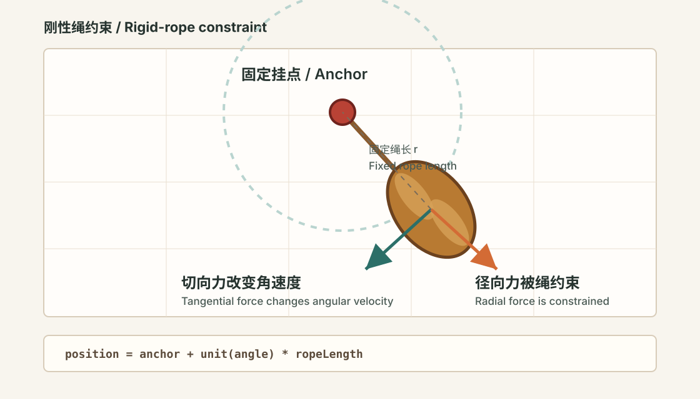
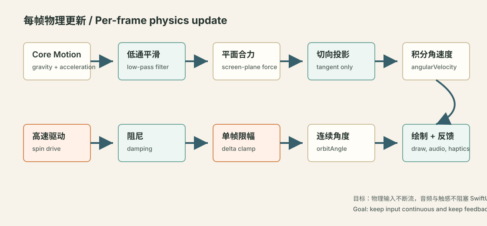
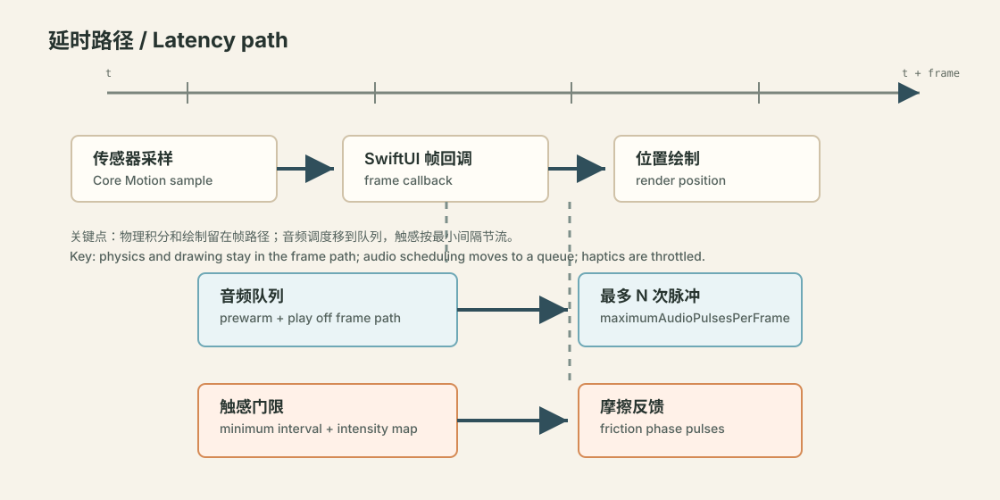

# 竹知了

语言：中文 | [English](README_en.md)

竹知了是一款 SwiftUI iOS 小应用，用手机或 iPad 复刻传统民间声玩“竹知了”。轻轻摇动设备，屏幕里的竹知了会旋转、鸣响，并通过触感反馈跟随手上的节奏。

## 功能

- 基于 Core Motion 的摇动与旋转动画。
- 竹林背景和民间童玩的视觉风格。
- 与摆动相位同步的低延时鸣声。
- 跟随摇动强度和旋转速度变化的触感反馈。
- 全屏介绍和关于页面。
- 应用内中文 / English 切换，默认中文显示。
- App Store 中英文截图和文案素材工作流。

## 环境要求

- Xcode 16 或更新版本
- iOS 17.6 或更新版本
- 建议使用真机测试运动、音频和触感效果

应用可以在模拟器中构建和运行，但核心交互依赖真实设备运动。

## 运行

1. 用 Xcode 打开 `Bamboo Cicada.xcodeproj`。
2. 选择 `Bamboo Cicada` scheme。
3. 选择一台 iPhone 或 iPad 真机。
4. Build and Run。

命令行构建：

```sh
xcodebuild \
  -project "Bamboo Cicada.xcodeproj" \
  -scheme "Bamboo Cicada" \
  -destination 'generic/platform=iOS' \
  -derivedDataPath DerivedData-CodexBuild \
  CODE_SIGNING_ALLOWED=NO \
  build
```

## 测试

可以在 Xcode 中运行单元测试和 UI 测试，也可以使用命令行：

```sh
xcodebuild \
  -project "Bamboo Cicada.xcodeproj" \
  -scheme "Bamboo Cicada" \
  -destination 'platform=iOS Simulator,name=iPhone 16' \
  test
```

## 项目结构

```text
Bamboo Cicada/
  App/                    SwiftUI 应用入口
  Configuration/          运动、音频和触感参数
  Features/Game/          运动模型、视图模型、音频、触感和玩具视图
  Features/Introduction/  介绍页、关于页和语言文案
  Shared/Views/           复用背景和布局辅助视图
  *.lproj/                本地化 Info.plist 字符串

AppStoreMarketing/        App Store 文案、源截图和生成脚本
bamboo-cicada.github.io/  官网截图素材
Bamboo CicadaTests/       单元测试
Bamboo CicadaUITests/     UI 测试
```

## 刚性绳物理模型

竹知了的运动被建模成“台球桌上的小球被一根刚性绳牵着”：屏幕平面就是桌面，红珠是固定挂点，竹知了只能沿固定半径的圆弧运动。绳子不会伸缩，也不会投影变短；任何径向力都被绳子约束吃掉，只有切线方向的力会改变角速度。



每一帧大致执行以下流程：



### 1. 输入映射

- `CMDeviceMotion.gravity` 表示手机姿态中的重力方向，是低速自然下垂的主要来源。
- `CMDeviceMotion.userAcceleration` 表示手甩手机产生的线性加速度，是高速甩动加速的主要来源。
- 控制器会保存平滑后的 `smoothedGravityX/Y` 与 `smoothedAccelerationX/Y`，避免传感器尖峰直接造成画面顿跳。

屏幕坐标中，向右为 `x+`，向下为 `y+`：

```text
gravityForce     = ( gravity.x, -gravity.y )
inertialForce    = ( -userAcceleration.x, userAcceleration.y )
tablePlaneForce  = gravityForce * gravityScale
                 + inertialForce * accelerationScale
```

这里的 `inertialForce` 使用反向加速度，模拟手机桌面突然移动时，小球因为惯性相对桌面“甩出去”的效果。

### 2. 刚性绳约束

竹知了的位置只由一个连续角度 `orbitAngle` 决定：

```text
screenAngle = 90° + orbitAngle
position.x  = anchor.x + cos(screenAngle) * ropeLength
position.y  = anchor.y + sin(screenAngle) * ropeLength
```

绳长 `ropeLength` 固定，所以视觉上的绳子永远从红珠连接到竹知了的连接点。物理上只把平面合力投影到圆周切线：

```text
tangent = ( -cos(orbitAngle), -sin(orbitAngle) )
tangentialForce = dot(tablePlaneForce, tangent)
angularVelocity += tangentialForce * ropeGravityResponse
```

`orbitAngle` 不再每帧归一化到 `0...360`，而是连续累计，避免大幅摆动跨过 0 度时出现 `359 -> 0` 的视觉跳变。

### 3. 低速重力区与高速甩动区

低速时，`highSpeedBlendRatio` 接近 `0`，重力几乎完整参与，竹知了会像被刚性绳牵着的小球一样自然下垂、回摆。

高速时，`highSpeedBlendRatio` 平滑接近 `1`：

- 重力影响降到 `highSpeedMinimumGravityInfluence`，避免高速旋转被重力持续拖慢。
- 加速度影响按 `highSpeedAccelerationBoost` 放大。
- 根据 `rawSway` 采样高速甩动方向 `highSpeedSpinDirection`。
- `applyHighSpeedSpinDrive` 会把现有角速度平滑拉向目标旋转速度，但不会重置角速度，因此低速摆动进入高速旋转时惯性会保留。
- `highSpeedBlendKickstartRatio` 会在第一次快速甩动时预先给一段高速混合比例，避免第一次起转从 0 慢慢爬升造成卡顿。

```text
低速：gravityScale ≈ 1.0        accelerationScale ≈ ropeAccelerationResponse
高速：gravityScale 降低          accelerationScale 放大
```

### 4. 延时与流畅性保护

为保证界面动画流畅，运动模型做了几层保护：

- `motionInputSmoothing`：平滑重力和加速度输入。
- `maximumAngularVelocityDeltaPerFrame`：限制单帧角速度变化，避免大幅加速度造成画面顿跳。
- `ropeAngularDamping`：每帧保留一部分角速度，让运动自然衰减。
- 音频播放、停止、预热放在独立 audio queue，避免 `AVAudioPlayer.play()` / `stop()` 阻塞 SwiftUI 帧回调。
- 声音单帧最多触发 `maximumAudioPulsesPerFrame` 次，避免极端高速下同一帧塞入太多音频事件。



### 5. 声音与摩擦触感

声音和触感分成两条通道：

- 声音完全由实际角速度决定，不再区分重力区/高速区；低速重力摆动也会累计声音相位，速度越快鸣声越密、播放速率越高。
- 摩擦触感跟随真实角位移，不区分重力区和高速区。只要绳子牵着竹知了在圆弧上滑动，就会积累触感相位，模拟绳子和玩具摩擦的质感。
- `frictionHapticMinimumIntensity` 保证低速重力摆动也有可感知的反馈。
- `frictionHapticSpeedMultiplier` 让触感随速度增强。

## 调参

主要交互手感集中在 `Bamboo Cicada/Configuration/CicadaTuning.swift`。

- `maximumSpinVelocityDegreesPerFrame`：刚性绳圆周运动的最高角速度。
- `ropeGravityResponse`：重力切向力转成角速度的响应。
- `ropeAccelerationResponse`：线性加速度转成惯性力的基础响应。
- `highSpeedBlendStartIntensity` / `highSpeedBlendEndIntensity`：低速重力区到高速甩动区的混合范围。
- `highSpeedMinimumGravityInfluence`：高速区仍保留的最小重力比例。
- `highSpeedAccelerationBoost`：高速区加速度放大倍率。
- `highSpeedSpinDriveResponse`：高速区追向目标旋转速度的力度。
- `motionInputSmoothing`：重力和加速度输入平滑。
- `maximumAngularVelocityDeltaPerFrame`：单帧角速度变化上限。
- `ropeAngularDamping`：旋转惯性保留比例。
- `ropeAudioVelocityDeadzone`：声音极低速噪声门限，只过滤静止微抖，不阻断低速摆动发声。
- `audioPhaseDegrees`：声音相位脉冲间隔。
- `frictionHapticPhaseDegrees`：摩擦触感相位间隔。
- `frictionHapticMinimumIntensity` / `frictionHapticSpeedMultiplier`：摩擦触感强度映射。
- `hapticMinimumInterval`：触感脉冲的最小间隔。
- `audioPrewarmDuration` / `audioPrewarmPlayerCount`：启动时音频预热配置。

## 营销素材

`AppStoreMarketing/` 包含 App Store 文案、源截图、生成后的上传截图和预览 contact sheet。具体目录说明见 `AppStoreMarketing/README.md`。

## 许可证

MIT License。见 `LICENSE`。
